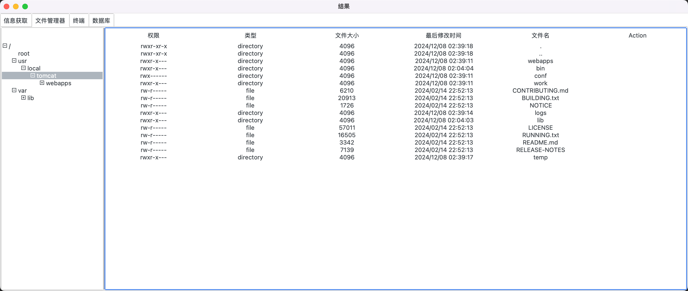

# webshell取证

# 简介

通过获取到的webshell流量、url、key来还原攻击者使用webshell所做的操作。

# 功能

- 支持冰蝎
- 还原攻击者行为，并生成一个webshell管理界面
- 还原历史命令、文件操作、数据库操作等等
- 支持更多的webshell类型
- 支持通过获取到的webshell去自动解密流量

# 设计

使用python tkinter进行GUI开发

运行gui.py文件后，需要填写相应的信息

填写后点击开始分析

分析完成后会有提示

点击OK后，进入分析结果界面

tab1 信息获取界面，主要包含webshell连接时获取到的一些系统变量

tab2 文件管理器，主要还原攻击者查看过的所有文件记录以及文件操作，后续添加对攻击者上传文件进行还原并支持下载

tab3 终端，主要还原攻击者执行过的所有命令

# Todo

- [ ] 目前只测试了jsp的功能，其他待测试
- [ ] 优化界面设计
- [ ] 支持所有文件操作的还原
- [ ] 支持哥斯拉
- [ ] 支持蚁剑
- [ ] 等等

# 感谢

[https://github.com/ba0gu0/behinder-decryptor](https://github.com/ba0gu0/behinder-decryptor "https://github.com/ba0gu0/behinder-decryptor")

## Stargazers over time

